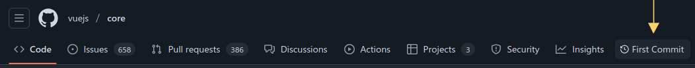

# First Commit

A simple userscript that adds a convenient **First Commit** navigation button to GitHub repositories, allowing you to quickly jump to the very first commit of any **public** repository.

## Installation

1. Install a userscript manager for your browser:
   - [Tampermonkey](https://www.tampermonkey.net) (Chrome, Firefox, Safari, Opera, Edge)
   - [Violentmonkey](https://violentmonkey.github.io) (Chrome, Firefox, Edge)
   - [Greasemonkey](https://addons.mozilla.org/en-US/firefox/addon/greasemonkey) (Firefox)

2. Install the script:
   - [Open the script in your browser](https://github.com/lazypolymath/first-commit/raw/main/dist/build.user.js) (or copy the contents of https://github.com/lazypolymath/first-commit/blob/main/dist/build.user.js and paste it into a newly created userscript)

## How It Works

The script identifies when you're on a GitHub repository page and inserts a new "First Commit" button in the repository navigation bar by querying the GitHub API to find the [first commit](https://github.com/khalidbelk/FirstCommitter/blob/main/server/githubApi.ts#L34) in the repository's history. Clicking the button takes you directly to the first commit.

## Compatibility

- Works with all modern browsers (Chrome, Firefox, Safari, Edge)
- Compatible with GitHub's regular and dark themes

## Source Code

The complete source code is available on [GitHub](https://github.com/lazypolymath/first-commit).

## Privacy

This userscript:
- Does not collect any user data
- Does not make requests to third-party services
- Only interacts with GitHub's own API and pages

## Roadmap

- [ ] Add support for private repositories

## Contributing

Contributions are welcome! Feel free to submit issues or pull requests if you have suggestions for improvements.

1. Fork the repository
2. Create your feature branch (`git checkout -b feature/amazing-feature`)
3. Commit your changes (`git commit -m 'Add some amazing feature'`)
4. Push to the branch (`git push origin feature/amazing-feature`)
5. Open a Pull Request

## License

This project is licensed under the [MIT License](LICENSE).